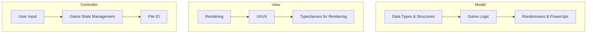

## Implementation Plan for Pacman Game

Following a logical progression will help ensure that foundational elements are in place before moving on to more complex features. Here's a structured plan:

### Phase 1: Setting up the Board

1. **Board Layout and Coordinate System:**
   - Decide on the dimensions of the game board.
   - Update the `Position` and `Vector` types to use `Float`.
   - Implement any conversion functions if you want to work with both `Int` and `Float`.
   
2. **Wall and Static Elements:**
   - Define the static layout of the walls using the `Wall` type.
   - Render these walls on the board.

3. **Food Placement:**
   - Place the food (`Food` type) items at designated positions on the board.
   - Ensure food isn't placed inside walls.

### Phase 2: Main Characters and Movement

4. **Implement Pacman:**
   - Create and place Pacman at a starting position.
   - Implement movement for Pacman using arrow keys.

5. **Ghost Creation and Basic Movement:**
   - Create ghosts (`Ghost` type) and place them at their starting positions.
   - Implement basic random movements for the ghosts to get them moving.

### Phase 3: Game Dynamics

6. **Pacman and Food Interaction:**
   - Detect when Pacman is on a `Food` position.
   - Increase score and remove the food item from the board upon collision.

7. **Pacman and Ghost Interaction:**
   - Detect collisions between Pacman and any ghost.
   - Implement life deduction or game end mechanics based on these interactions.

8. **PowerUps:**
   - Randomly place power-ups (`PowerUp` type) on the board.
   - Implement the effect of each power-up (like invulnerability or increased speed) when Pacman consumes them.

### Phase 4: Advanced Game Features

9. **Advanced Ghost Movement:**
   - Replace the basic random movement of ghosts with the distance-based pathfinding algorithm.

10. **Animations:**
    - Implement animations for Pacman eating, dying, and consuming power-ups.
    - Ensure animations are associated with their respective entities (like attaching an eating animation to Pacman).

11. **Randomness & PowerUps:**
    - Integrate seed-based pseudo-random number generation for power-up placements and any other randomness required in the game.

### Phase 5: Game States and External Interactions

12. **Pause Mechanism:**
    - Implement the ability to pause the game using the 'p' key.

13. **File IO:**
    - Set up the ability to save and load high scores.
    - Implement customization by loading different icons for Pacman.

14. **Game State Management:**
    - Organize the game state (`GameState` type) to keep track of all dynamic elements of the game.
    - Implement game states like "Running", "Paused", "Game Over", etc.

### Phase 6: Refinement and Abstraction

15. **Implement Typeclasses:**
    - Define and implement the `Renderable`, `Boundable`, and `Movable` typeclasses.
    - Refactor existing code to use these typeclasses, promoting code reusability and abstraction.

16. **Testing and Refinement:**
    - Thoroughly test all game mechanics.
    - Refine any features or interactions that feel clunky or unintuitive.

### Phase 7: Final Touches

17. **UI/UX:**
    - Enhance the game's visual appeal with better sprites, animations, and possibly background music.
    - Add a main menu, options to restart the game, and display high scores.

18. **Documentation:**
    - Document the code comprehensively.
    - Provide user instructions and any necessary credits.
```haskell
-- Phase 1:
type Position = (Float, Float)
type Vector = (Float, Float)
type Wall = Position

-- Phase 2:
type Food = Position
data Direction = Up | Down | Left | Right
data Pacman = Pacman 
  { position :: Position
  , direction :: Direction
  , lives :: Int 
  }
data GhostType = Clyde | Inky | Pinky | Blinky
data Ghost = Ghost 
  { position :: Position
  , direction :: Direction
  , ghostType :: GhostType
  }

-- Phase 3:
data PowerUpType = Cherry | Strawberry
data PowerUp = PowerUp 
  { position :: Position
  , duration :: Int
  , powerUpType :: PowerUpType
  }

-- Phase 4:
data Animation = Animation 
  { position :: Position
  , duration :: Int
  }

-- Phase 5:
data GameState = GameState 
  { pacman :: Pacman
  , ghosts :: [Ghost]
  , food :: [Food]
  , walls :: [Wall]
  , score :: Int
  , powerUps :: [PowerUp]
  , pause :: Bool
  }
```

```mermaid
graph TB

subgraph "Phase 1: Setting up the Board"
    A1["1. Board Layout & Coordinate System"]
    A2["2. Wall and Static Elements"]
    A3["3. Food Placement"]

    A1a[Decide on dimensions]
    A1b[Update Position & Vector to Float]
    A1c[Conversion functions]
    A1 --> A1a
    A1 --> A1b
    A1 --> A1c

    A2a[Define static layout with Wall type]
    A2b[Render walls on board]
    A2 --> A2a
    A2 --> A2b

    A3a[Place food items]
    A3b[Ensure food isn't inside walls]
    A3 --> A3a
    A3 --> A3b
end

subgraph "Phase 2: Characters & Movement"
    B1["4. Implement Pacman"]
    B2["5. Ghost Creation & Movement"]

    B1a[Create & place Pacman]
    B1b[Implement movement using arrows]
    B1 --> B1a
    B1 --> B1b

    B2a[Create ghosts]
    B2b[Implement basic random movements]
    B2 --> B2a
    B2 --> B2b
end

subgraph "Phase 3: Game Dynamics"
    C1["6. Pacman & Food Interaction"]
    C2["7. Pacman & Ghost Interaction"]
    C3["8. PowerUps"]

    C1a[Detect Pacman on Food]
    C1b[Increase score & remove food]
    C1 --> C1a
    C1 --> C1b

    C2a[Detect collisions with ghost]
    C2b[Life deduction or game end]
    C2 --> C2a
    C2 --> C2b

    C3a[Place power-ups]
    C3b[Implement power-up effects]
    C3 --> C3a
    C3 --> C3b
end

subgraph "Phase 4: Advanced Features"
    D1["9. Advanced Ghost Movement"]
    D2["10. Animations"]
    D3["11. Randomness & PowerUps"]

    D1a[Distance-based pathfinding]
    D1 --> D1a

    D2a[Implement various animations]
    D2b[Associate animations with entities]
    D2 --> D2a
    D2 --> D2b

    D3a[Integrate pseudo-random generation]
    D3 --> D3a
end

subgraph "Phase 5: States & External"
    E1["12. Pause Mechanism"]
    E2["13. File IO"]
    E3["14. Game State Management"]

    E1a[Pause game with 'p' key]
    E1 --> E1a

    E2a[Save & load high scores]
    E2b[Load different icons for Pacman]
    E2 --> E2a
    E2 --> E2b

    E3a[Organize game state]
    E3b[Implement game states]
    E3 --> E3a
    E3 --> E3b
end

subgraph "Phase 6: Refinement"
    F1["15. Implement Typeclasses"]
    F2["16. Testing & Refinement"]

    F1a[Define and implement typeclasses]
    F1b[Refactor code to use typeclasses]
    F1 --> F1a
    F1 --> F1b

    F2a[Test game mechanics]
    F2b[Refine features]
    F2 --> F2a
    F2 --> F2b
end

subgraph "Phase 7: Final Touches"
    G1["17. UI/UX"]
    G2["18. Documentation"]

    G1a[Enhance visual appeal]
    G1b[Main menu, restart, & high scores]
    G1 --> G1a
    G1 --> G1b

    G2a[Document code]
    G2b[Provide user instructions]
    G2 --> G2a
    G2 --> G2b
end
```



For the **MVC (Model-View-Controller)** model:

### Model
This part will contain the data and the logic of your game.

1. **Data Types and Structures:**
   - All the data types such as `Position`, `Food`, `Wall`, `PowerUp`, `Pacman`, `Ghost`, and `GameState`.
   - Logic for updating these data structures, such as moving Pacman or a Ghost, consuming a PowerUp, etc.

2. **Game Logic:**
   - Collision detection between Pacman and other entities (like food or ghosts).
   - Effects of power-ups.
   - Score computation.
   - Game state transitions, e.g., from "Running" to "Paused" or "Game Over".

3. **Randomness & PowerUps:**
   - Logic for the seed-based pseudo-random number generation.

### View
This represents the presentation layer, responsible for displaying the game to the player.

1. **Rendering:**
   - Drawing the game board, including walls and static elements.
   - Displaying Pacman, ghosts, food, power-ups, and other game entities.
   - Showing animations associated with events, like Pacman eating or dying.

2. **UI/UX:**
   - Displaying the game's score, lives left, and other relevant indicators.
   - Any additional interfaces like the main menu, options, high scores, etc.

3. **Typeclasses for Rendering:**
   - Implement the `Renderable` typeclass to abstract the rendering of different game entities.

### Controller
This will handle user input and manage the flow of the game.

1. **User Input:**
   - Capturing arrow key presses to move Pacman.
   - Detecting other key presses, like "p" for pause or other controls you might implement.

2. **Game State Management:**
   - Transitioning between different game states based on user input or game events. For instance, transitioning to "Paused" when "p" is pressed.
   - Managing the game loop, where the game repeatedly checks for user input, updates the game state, and then renders the updated state.

3. **File IO:**
   - Handling reading from and writing to files, for features like high scores or customization.

